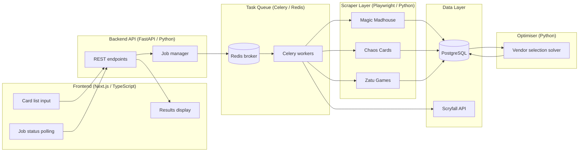
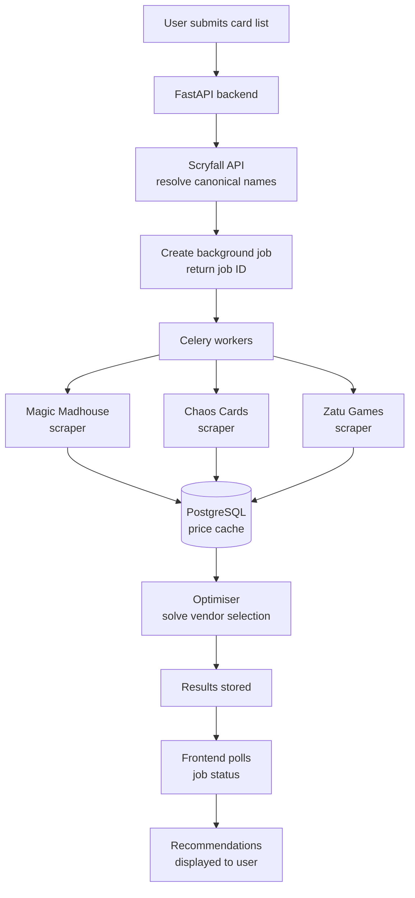

# MTG Deck Finder — Architecture

## Overview

MTG Deck Finder is a web application that helps Magic: The Gathering 
players find the cheapest way to purchase a deck across multiple UK 
vendors, accounting for per-vendor shipping costs.

---

## System Architecture

### Components

**Frontend (Next.js / TypeScript)**
- Single page application
- Card list input and search interface
- Polls backend for job status
- Displays vendor recommendations and cost breakdown

**Backend API (FastAPI / Python)**
- Exposes REST endpoints for card search and job management
- Coordinates between Scryfall, scrapers, and the optimiser
- Manages background job queue

**Scraper Layer (Python / Playwright)**
- One module per vendor
- Returns standardised price and stock data
- Rate limited and respectful of vendor ToS

**Scryfall Integration (Python / httpx)**
- Canonical card name resolution
- Fuzzy name matching for user input
- Card image and metadata retrieval

**Optimiser (Python)**
- Receives aggregated prices across all vendors
- Solves vendor selection problem to minimise total cost
- Accounts for per-vendor shipping thresholds

**Task Queue (Celery / Redis)**
- Scraping jobs run asynchronously
- Frontend polls for completion
- Prevents HTTP timeout on long scrape operations

**Database (PostgreSQL)**
- Caches scraped price data
- Stores job state and results

### Component Diagram

---

## Data Flow

1. User submits a list of card names
2. API resolves each name via Scryfall (canonical name + metadata)
3. A background job is created and job ID returned to frontend
4. Celery workers scrape all vendors in parallel for each card
5. Results are cached in PostgreSQL
6. Optimiser runs against aggregated results
7. Frontend polls job status endpoint until complete
8. Recommendations returned to user

### Data Flow Diagram

---

## Vendor Coverage

| Vendor | Status |
|---|---|
| Magic Madhouse | Complete |
| Chaos Cards | Planned |
| Zatu Games | Planned |

---

## Tech Stack

| Layer | Technology |
|---|---|
| Frontend | Next.js, TypeScript, React |
| Backend API | FastAPI, Python 3.11+ |
| Scraping | Playwright, httpx, BeautifulSoup |
| Task Queue | Celery, Redis |
| Database | PostgreSQL |
| Hosting | Railway |
| Card Data | Scryfall API |

---

## Key Design Decisions

**Why Playwright over httpx for vendor scraping?**
Vendor sites use JavaScript-rendered search results (Klevu). 
A real browser is required to execute the JS before scraping the DOM.

**Why async job processing?**
Scraping 75 cards across 3+ vendors sequentially would take too long 
for a synchronous HTTP request. Background jobs with polling gives a 
better user experience and avoids gateway timeouts.

**Why Scryfall as the canonical source?**
User input and vendor listings both use inconsistent card naming. 
Scryfall provides a single authoritative reference that normalises 
both sides of the comparison.