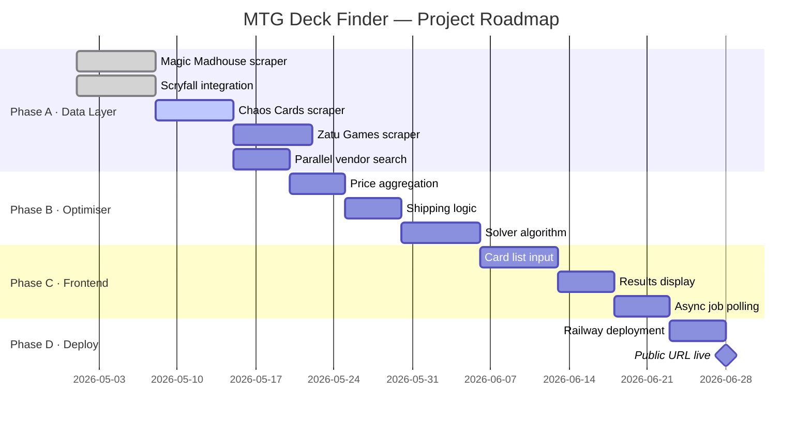

```mermaid
gantt
    title MTG Deck Finder — Project Roadmap
    dateFormat  YYYY-MM-DD
    section Phase A · Data Layer
    Magic Madhouse scraper     :done,    a1, 2026-05-01, 7d
    Scryfall integration       :done,    a2, 2026-05-01, 7d
    Chaos Cards scraper        :active,  a3, after a2,   7d
    Zatu Games scraper         :         a4, after a3,   7d
    Parallel vendor search     :         a5, after a3,   5d
    section Phase B · Optimiser
    Price aggregation          :         b1, after a5,   5d
    Shipping logic             :         b2, after b1,   5d
    Solver algorithm           :         b3, after b2,   7d
    section Phase C · Frontend
    Card list input            :         c1, after b3,   7d
    Results display            :         c2, after c1,   5d
    Async job polling          :         c3, after c2,   5d
    section Phase D · Deploy
    Railway deployment         :         d1, after c3,   5d
    Public URL live            :milestone, after d1,     0d
```